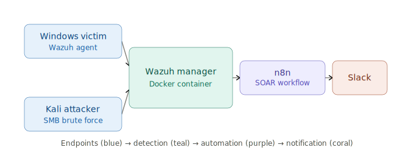

# SOC Home Lab: Wazuh + n8n SOAR Pipeline

A self-built Security Operations Center home lab implementing detection, alerting, and automated
response using open-source tooling — built end-to-end from bare Docker containers to a working
SOAR pipeline delivering real-time alerts to Slack.

## Overview

This lab simulates a small enterprise SOC environment: a monitored Windows endpoint, an attacker
machine (Kali Linux) generating realistic attack traffic, a Wazuh SIEM/XDR manager for detection,
and an n8n-based SOAR layer for automated alert routing and notification.

**Why this project:** hands-on demonstration of SIEM/SOAR operations, log analysis, detection
engineering, and infrastructure troubleshooting — the core skill set for a SOC L1 analyst role.

## Architecture

Endpoints (Windows victim, Kali attacker) feed into the Wazuh manager, which forwards matched
alerts to n8n, which posts formatted notifications to Slack.

**Host:** `soc-brain` — headless Ubuntu VM running Wazuh 4.7.0 (Docker Compose, single-node) and
n8n as a standalone container, bridged onto the same Docker network for integration webhook calls.

## Tech Stack

| Layer | Tool |
|---|---|
| SIEM / XDR | Wazuh 4.7.0 |
| SOAR / Automation | n8n |
| Notification | Slack (Incoming Webhook) |
| Attacker tooling | Kali Linux, nmap |
| Monitored endpoint | Windows (Wazuh agent) |
| Container orchestration | Docker Compose |
| Custom integration | Python (`requests`) |

## Detection Scenarios

| Scenario | Wazuh Rule ID | Trigger | Status |
|---|---|---|---|
| Windows failed login | 60122 | Repeated failed auth attempts | ✅ Confirmed end-to-end |
| SMB brute force | 92032 / 92052 | nmap SMB enumeration/brute force from Kali | ✅ Confirmed end-to-end |

See [`docs/attack-scenarios.md`](docs/attack-scenarios.md) for full detection logic .

*(Roadmap: expanding to 2–3 additional MITRE ATT&CK-mapped scenarios — see Future Work.)*

## Alert Pipeline

1. Wazuh manager detects a rule match (e.g., rule 60122 or 92032/92052).
2. A custom integration script (`custom-n8n.py`, wrapped by a `custom-n8n` shell script) fires
   on rule match and POSTs the alert to an n8n Webhook.
3. n8n workflow: **Webhook → HTTP Request → Slack Incoming Webhook**, formatting and routing the
   alert to a dedicated Slack channel in near real time.
4. Verified persistent across full `docker compose down/up` cycles — alerting survives restarts,
   not just the initial session.

## Key Engineering Challenges Resolved

Building this wasn't just following a tutorial — most of the value was in diagnosing real
infrastructure failures:

- **Silent config overwrite** — a redundant `wazuh_manager.conf` volume mount was silently
  overwriting `ossec.conf` on container start, undoing manual rule changes.
- **UID permission mismatch** — host UID 1000 vs. Wazuh daemon UID 101 caused `wazuh-db` and a
  cascade of dependent daemons (`analysisd`, `remoted`, etc.) to fail silently.
- **Network orphaning on compose cycles** — n8n lost connectivity to the Wazuh manager network
  after every `docker compose down/up` until the external network was explicitly declared.
- **Integration script security check** — Wazuh's `wpopenv` check rejected the custom integration
  wrapper until permissions were corrected to `chmod 550`.
- **Python dependency isolation** — `requests` had to be installed into Wazuh's *bundled* Python
  interpreter (`/var/ossec/framework/python/bin/pip3`), not system pip, and targeted at the
  integration directory (`-t /var/ossec/integrations/`) to persist correctly.
- **Disk space exhaustion** — resolved via LVM volume extension (`lvextend` + `resize2fs`) when
  the VM ran out of space mid-build.

Full day-by-day debugging log: [`docs/troubleshooting-log.md`](docs/troubleshooting-log.md)

## Mapping to Enterprise SOC Tools

| This lab | Enterprise equivalent |
|---|---|
| Wazuh rules & decoders | Splunk correlation searches / QRadar custom rules |
| Wazuh dashboard | Splunk ES / Sentinel workbooks |
| n8n SOAR workflow | Splunk SOAR (Phantom) / Palo Alto XSOAR playbooks |
| Custom Python integration | Splunk/QRadar custom app or scripted alert action |

## Setup / Reproduction

> Requires Docker, Docker
> Compose, a Slack workspace with an Incoming Webhook configured, and network connectivity
> between a Windows agent, Kali attacker VM, and the Wazuh manager host.

## Future Work

- [ ] Add 2–3 additional MITRE ATT&CK-mapped attack scenarios (e.g., privilege escalation,
      lateral movement, persistence mechanisms)
- [ ] Build a Python log parser targeting Wazuh's JSON alert file for custom enrichment
- [ ] Add SC-200 (Microsoft Security Operations Analyst) concepts — bridge Wazuh detections to
      Sentinel KQL queries
- [ ] Add automated incident ticketing step to the SOAR workflow

## Disclaimer

This is a personal home lab for educational and portfolio purposes. All IPs, hostnames, and
credentials in this repo are sanitized/placeholder values .
---
**Author:** Aryan | Cybersecurity student, SOC Project
